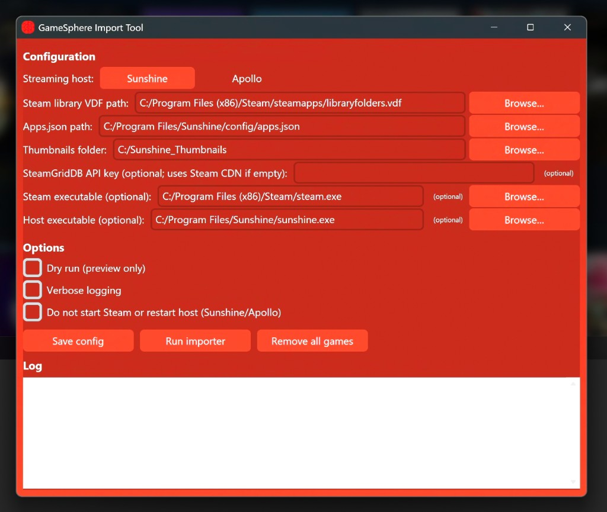

# GameSphere Import Tool

**GameSphere Import Tool** imports your installed Steam games into [Sunshine](https://github.com/LizardByte/Sunshine) or [Apollo](https://github.com/ClassicOldSong/Apollo) (game streaming hosts), with thumbnail artwork. **No signup for thumbnails:** art is fetched from Steam’s CDN by default (same approach as the [GameSphere](https://github.com/trevlars/GameSphere) client). An optional SteamGridDB API key can be used for community picks.

> **Credit — Original Python project**  
> This project is a fork of **[Sunshine-App-Automation](https://github.com/CommonMugger/Sunshine-App-Automation)** by [CommonMugger](https://github.com/CommonMugger). The original Python automation (Steam detection, config handling, thumbnails, and CLI) was the foundation for this tool. We added a Windows GUI, Apollo support, GameSphere branding, and other improvements. Thank you to CommonMugger for the original work. 

Example:



## Features

- **Automatically detects installed Steam games** with concurrent processing for speed
- **Epic Games Store** — detects installed Epic games (Windows) and adds them with launch commands and optional thumbnails (SteamGridDB search by name)
- **Xbox / Windows games** — auto-discovers games in the usual Xbox install folder (`C:\XboxGames` by default; Game Pass, Minecraft, etc.) using `MicrosoftGame.config` or by scanning for executables
- **Custom games** — add any game by path via a JSON file (e.g. games not in `C:\XboxGames`); thumbnails from SteamGridDB by name when available
- **Fetches game names and thumbnail images** — Steam CDN by default (no API key); optional SteamGridDB for community art
- **Updates Sunshine/Apollo apps.json** with Steam, Epic, and custom games and their thumbnail images
- **Cross-platform support** for Windows, Linux, and macOS
- **Robust error handling** with comprehensive logging
- **Command-line options** for verbose output, dry runs, and more
- **Environment-based configuration** using .env files
- **Automatic backup** of configuration files before changes
- **Standalone Windows .exe** — build once, share with users who don’t have Python

## Prerequisites

Before you begin, ensure you have met the following requirements:

- **Python 3.12 or higher** installed
- **uv package manager** (recommended) or pip
- **Sunshine** or **Apollo** installed and configured
- **(Optional)** A [SteamGridDB](https://www.steamgriddb.com/profile/preferences/api) API key for community thumbnail art; if omitted, thumbnails use Steam’s CDN with no signup

## Installation

### Recommended: Using uv (Fast and Modern)

1. **Install uv** if you haven't already:
   ```bash
   # Windows
   powershell -ExecutionPolicy ByPass -c "irm https://astral.sh/uv/install.ps1 | iex"
   
   # macOS/Linux
   curl -LsSf https://astral.sh/uv/install.sh | sh
   ```

2. **Clone this repository**:
   ```bash
   git clone https://github.com/trevlars/Gamesphere-Import-Tool.git
   cd Gamesphere-Import-Tool
   ```

3. **Install dependencies using uv**:
   ```bash
   uv sync
   ```

### Alternative: Using pip

1. **Install Python dependencies**:
   ```bash
   pip install -r requirements.txt
   ```

## Windows GUI

On Windows you can use the **Gamesphere Import Tool** GUI instead of the command line:

1. Install dependencies (including `customtkinter`):  
   `pip install -r requirements.txt` or `uv sync`
2. Run the GUI:  
   `python gui.py` or `uv run gui.py`
3. Choose **Sunshine** or **Apollo** as the streaming host (default paths update automatically).
4. Fill in the paths (SteamGridDB API key is optional — leave blank to use Steam CDN thumbnails); use **Browse** to pick files/folders.
5. Use **Save config** to write a `.env` file, then **Run importer** to run the automation. **Remove all games** removes all games (Steam + manually added) and keeps only stock apps (Desktop, Steam, Virtual Display) with their thumbnails. Log output appears in the window.

The GUI uses the same `.env` as the CLI, so you can switch between GUI and command line.

### Standalone Windows .exe

You can build a single **.exe** so others can run the tool without installing Python:

1. **On a Windows machine**, install the build optional dependency:
   ```bash
   uv sync --extra build
   # or: pip install pyinstaller
   ```
2. Build the executable:
   ```bash
   uv run build_exe.py
   # or: pyinstaller GamesphereImportTool.spec
   ```
3. The executable is created at `dist/GamesphereImportTool.exe`. Copy it (and optionally a `.env` or `.env.example`) to share.
4. **End users:** Put the `.exe` in a folder, run it, set paths in the GUI (API key optional), save config, then click **Run importer**. No Python installation required.

### Publishing a release (downloadable .exe on GitHub)

You can ship the .exe via **GitHub Releases** so people can download it without cloning the repo.

**Option A — Build on Windows, then create the release**

1. On a **Windows** machine, build the .exe (see above):  
   `uv sync --extra build` then `uv run build_exe.py`
2. On GitHub: **Releases** → **Create a new release**.
3. Choose a **tag** (e.g. `v0.2.0`). Create the tag if it doesn’t exist.
4. Set **Release title** (e.g. `v0.2.0`) and add **Description** (changelog, usage notes).
5. Under **Assets**, click **Attach binaries** and upload `dist/GamesphereImportTool.exe`.
6. Publish the release. The .exe will be available for download on the release page.

**Option B — Let GitHub Actions build the .exe (no Windows PC needed)**

The repo includes a workflow that builds the .exe and attaches it to the release automatically:

1. Create and push a **tag** (e.g. `v0.2.0`):
   ```bash
   git tag v0.2.0
   git push origin v0.2.0
   ```
2. On GitHub: **Releases** → **Draft a new release**.
3. Choose the tag you pushed (e.g. `v0.2.0`), add title and description, then **Publish release**. Do not upload any files.
4. The **Build Windows exe** workflow runs on GitHub’s Windows runner. When it finishes, `GamesphereImportTool.exe` is attached to the release automatically. Check **Actions** for build status.
5. Download the .exe from the release’s **Assets** section.

## Configuration

The script now uses environment variables for configuration. Create a `.env` file in the project directory:

```env
# Required variables
STEAM_LIBRARY_VDF_PATH=C:/Program Files (x86)/Steam/steamapps/libraryfolders.vdf
SUNSHINE_APPS_JSON_PATH=C:/Program Files/Sunshine/config/apps.json
SUNSHINE_GRIDS_FOLDER=C:/Sunshine_Thumbnails

# Optional: SteamGridDB API key for community thumbnail art; leave empty to use Steam CDN (no signup)
STEAMGRIDDB_API_KEY=

# Optional variables (for Windows process restart)
STEAM_EXE_PATH=C:/Program Files (x86)/Steam/steam.exe
SUNSHINE_EXE_PATH=C:/Program Files/Sunshine/sunshine.exe

# Optional: Epic Games Store (Windows). Defaults to C:/ProgramData/Epic/EpicGamesLauncher/Data/Manifests if empty
EPIC_MANIFESTS_PATH=

# Optional: path to a JSON file listing custom games. See custom_games.example.json
CUSTOM_GAMES_JSON_PATH=

# Optional: Xbox/Windows games root folder(s), comma-separated (e.g. C:/XboxGames,D:/XboxGames). Default on Windows: C:/XboxGames
XBOX_GAMES_FOLDERS=

# Optional: folder for auto-generated .lnk shortcuts (Windows). If set, Epic/Xbox/custom games use shortcuts here and Sunshine launches via them (can help with permissions).
SUNSHINE_SHORTCUTS_FOLDER=
```

### Path Examples by Platform:

**Windows:**
- Steam Library: `C:/Program Files (x86)/Steam/steamapps/libraryfolders.vdf`
- Sunshine Apps: `C:/Program Files/Sunshine/config/apps.json`
- Thumbnails folder: `C:/Sunshine_Thumbnails`

**Linux:**
- Steam Library: `/home/username/.local/share/Steam/steamapps/libraryfolders.vdf`
- Sunshine Apps: `/home/username/.config/sunshine/apps.json`
- Thumbnails folder: `/home/username/.config/sunshine/grids`

**macOS:**
- Steam Library: `/Users/username/Library/Application Support/Steam/steamapps/libraryfolders.vdf`
- Sunshine Apps: `/Users/username/.config/sunshine/apps.json`
- Thumbnails folder: `/Users/username/.config/sunshine/grids`

## Usage

### Basic Usage

```bash
# Using uv (recommended)
uv run main.py

# Using python directly
python main.py
```

### Command-line Options

```bash
# Verbose logging for debugging
uv run main.py --verbose

# Preview changes without making them
uv run main.py --dry-run

# Remove all games (Steam + manually added); keeps only stock apps (Desktop, Steam, Virtual Display)
uv run main.py --remove-games

# Skip starting Steam (if not running) and skip restarting the streaming host
uv run main.py --no-restart

# Combine options
uv run main.py --verbose --dry-run
```

### What the script does:

1. **Validates configuration** and checks all required paths
2. **Loads Steam library** and discovers installed games (concurrent processing)
3. **Loads Epic Games** (Windows) from the manifests folder if configured
4. **Discovers Xbox/Windows games** in `XBOX_GAMES_FOLDERS` (e.g. `C:\XboxGames`) if set
5. **Loads custom games** from your JSON file if `CUSTOM_GAMES_JSON_PATH` is set
6. **Downloads thumbnail images** from Steam CDN (or SteamGridDB if API key is set); Epic/Xbox/custom use SteamGridDB search by name when available
7. **Updates Sunshine/Apollo configuration** with new games and removes uninstalled ones (Steam/Epic); Xbox and custom games stay until removed from folder/JSON or you use Remove all games
8. **Creates backups** of your configuration before making changes
9. **Provides detailed logging** of all operations

### Xbox / Windows games (Game Pass, Minecraft, etc.)

Games installed via the Xbox app are usually in **C:\XboxGames**. Set `XBOX_GAMES_FOLDERS` to that path (or leave it blank on Windows to use the default). You can use multiple folders separated by commas (e.g. `C:/XboxGames,D:/XboxGames`). The tool discovers each game from `MicrosoftGame.config` when present, or by finding executables in each subfolder.

### Custom games (games not in Steam, Epic, or C:\XboxGames)

1. Copy `custom_games.example.json` to `custom_games.json` (or any path).
2. Edit the `games` array: each entry needs `name` and `cmd` (full path to the game executable). `image_path` is optional (leave empty to try SteamGridDB by name).
3. Set `CUSTOM_GAMES_JSON_PATH` in your `.env` to the path of your JSON file.
4. Run the importer. Custom games are added and stay until you remove them from the JSON or use **Remove all games**.

### Shortcuts folder (optional, Windows)

If you set `SUNSHINE_SHORTCUTS_FOLDER` (e.g. `C:/Sunshine_Shortcuts`), the tool will create **.lnk shortcut files** there for each Epic, Xbox, and custom game. Sunshine/Apollo will then launch games by running those shortcuts (via `cmd /c start "" "path\to\shortcut.lnk"`), which can help when the game exe is in a protected location or you want all launchables in one folder. The shortcuts folder is created automatically; **Remove all games** also deletes all `.lnk` files in it.

## Troubleshooting

### Common Issues

- **"Invalid argument" errors**: Check your `.env` file paths use forward slashes `/` or double backslashes `\\`
- **"Access Denied" / "Permission denied" when saving config**: If Apollo or Sunshine is installed under `C:\Program Files`, the tool must write to that folder. Right-click the app (or shortcut) and choose **Run as administrator**, then run the importer again. Backups are saved to your user folder if the config directory is not writable.
- **API rate limiting**: The script includes automatic retry logic with backoff
- **Missing games**: Some games may not have data available in Steam's API

### Log Files

The script creates detailed logs in `sunshine_automation.log`. Use `--verbose` for more detailed output.

### Environment Variable Issues

If you're having path issues, the script will now:
- Automatically normalize Windows paths
- Validate that required directories exist
- Give clear error messages about what's wrong

### Platform-Specific Notes

**Linux with Flatpak Steam:**
The script automatically detects Flatpak Steam installations and uses the correct command format.

**macOS:**
Steam paths may vary depending on installation method (Steam app vs manual install).

## Repository

**[github.com/trevlars/Gamesphere-Import-Tool](https://github.com/trevlars/Gamesphere-Import-Tool)**

## Contributing

Contributions to improve the script are welcome. Please feel free to submit a Pull Request.

## Changelog

### GameSphere Import Tool (this fork)
- Windows GUI (CustomTkinter) with config form and log output; GameSphere branding and red theme
- **Sunshine** and **Apollo** support with host selector and default paths
- **Remove all games** removes all games (Steam + manually added); keeps only stock apps (Desktop, Steam, Virtual Display)
- Host restart works for both Sunshine and Apollo
- Credit to [CommonMugger/Sunshine-App-Automation](https://github.com/CommonMugger/Sunshine-App-Automation) for the original Python automation

### v2.0 (upstream)
- Complete rewrite with improved architecture
- Environment variable configuration
- Concurrent processing, retry logic, cross-platform CLI

### v1.0 (original)
- Basic Steam game detection and SteamGridDB integration

## Acknowledgements

- **[CommonMugger/Sunshine-App-Automation](https://github.com/CommonMugger/Sunshine-App-Automation)** — original Python project this fork is based on. The core automation (Steam library parsing, Sunshine/Apollo config updates, thumbnail handling, and CLI) comes from that repo. Thank you to [CommonMugger](https://github.com/CommonMugger) for the original work.
- [Sunshine](https://github.com/LizardByte/Sunshine) and [Apollo](https://github.com/ClassicOldSong/Apollo) — game streaming hosts
- [Steam CDN](https://partner.steamgames.com/doc/store/assets/libraryassets) and optional [SteamGridDB](https://www.steamgriddb.com/) for thumbnail images
- [GameSphere](https://github.com/trevlars/GameSphere) — TV client that pairs with this importer; GUI styling and branding are inspired by it
- [uv](https://github.com/astral-sh/uv) for fast Python package management

---

## Legal disclaimer

<sub>*Fine print. This project is provided for convenience only. You are responsible for your own setup and any effects of using this software.*</sub>

**Use at your own risk.** This software is provided **“as is”** without warranty of any kind. The authors and contributors are not liable for any damage to your computer, operating system, games, game saves, Steam or Sunshine/Apollo configuration, or any other software or data arising from the use or misuse of this tool. Back up your configuration and important data before use. This project is not affiliated with, endorsed by, or supported by Valve (Steam), LizardByte (Sunshine), Apollo, SteamGridDB, or any other third-party product or service mentioned here. All trademarks are property of their respective owners.