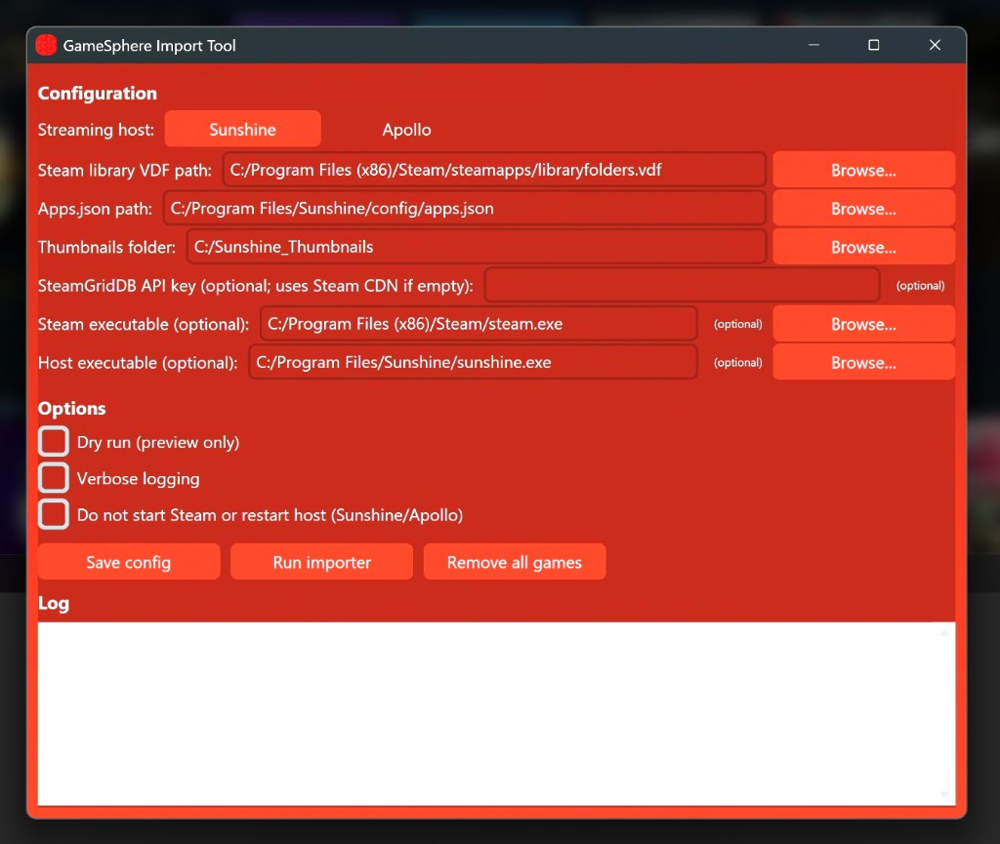

# GameSphere Import Tool

**Populate Sunshine or Apollo with your Steam library — automatically.**

The GameSphere Import Tool reads your installed Steam games, downloads box art (Steam CDN by default — no signup), writes the host `apps.json`, and restarts the streaming service. On Linux it is designed to be **automagic**: paths, launch commands, and service restart are detected for you.

Built for [GameSphere](https://github.com/trevlars/GameSphere) (Moonlight clients on iPhone, iPad, and Apple TV) and any Moonlight client.



> Fork of **[Sunshine-App-Automation](https://github.com/CommonMugger/Sunshine-App-Automation)** by [CommonMugger](https://github.com/CommonMugger). We added Apollo support, a Windows GUI, Linux/Bazzite automagic, and GameSphere branding.

---

## Quick start

### Linux — Bazzite, Steam Deck, or any distro (recommended flow)

One command installs, detects paths, and creates `gamesphere-import`:

```bash
curl -fsSL https://raw.githubusercontent.com/trevlars/Gamesphere-Import-Tool/main/scripts/install-linux.sh | bash
gamesphere-import --dry-run   # preview (optional)
gamesphere-import             # import + restart Sunshine
```

**No `.env` editing required** on typical setups. The tool finds native or Flatpak Steam, Sunshine/Apollo config, and uses `systemctl --user restart sunshine` when that service exists.

### Windows — GUI or `.exe`

1. Download **`GamesphereImportTool.exe`** from [Releases](https://github.com/trevlars/Gamesphere-Import-Tool/releases/latest).
2. Run it → choose **Sunshine** or **Apollo** → **Save config** → **Run importer**.

Or from source: `uv sync` then `uv run gui.py`.

### macOS — CLI

```bash
git clone https://github.com/trevlars/Gamesphere-Import-Tool.git && cd Gamesphere-Import-Tool
uv sync && uv run main.py --auto-config && uv run main.py
```

---

## What happens automatically

When you run the importer with no manual setup:

| Automagic step | Details |
|----------------|---------|
| **Path detection** | Steam `libraryfolders.vdf`, host `apps.json`, covers folder — native, Flatpak, or Windows Program Files |
| **Host profile** | Detects Bazzite, SteamOS, Windows, macOS |
| **Steam launch commands** | Windows: `steam://rungameid/…` · Linux: `detached` + `setsid steam …` (Sunshine requirement) · Flatpak when needed |
| **Stream prep hooks** | On Bazzite, adds `sunshine-stream-prep.sh` prep to imported games when that script exists |
| **Artwork** | Steam CDN thumbnails in parallel (optional [SteamGridDB](https://www.steamgriddb.com/profile/preferences/api) key) |
| **Merge, don’t wipe** | Keeps your Desktop, Steam Big Picture, and custom `prep-cmd` entries |
| **Prune** | Removes uninstalled Steam (and Epic on Windows) games from the host list |
| **Backup** | Copies `apps.json` before writing |
| **Repair** | Re-import fixes Linux entries that used `cmd` instead of `detached` |
| **Start Steam** | Launches Steam if it isn’t running |
| **Restart host** | Windows exe · Linux systemd · Flatpak restart |

Inspect what would be detected without importing:

```bash
gamesphere-import --print-config
```

---

## Features

- **Steam** — all installed library games with concurrent name/art fetch
- **Windows extras** — Epic Games Store (beta), Xbox / Game Pass (`C:\XboxGames`), custom JSON games, `.lnk` shortcuts
- **Sunshine & Apollo** — same tool; set `HOST=apollo` or use the Windows GUI host selector
- **Cross-platform CLI** — Windows, Linux, macOS
- **Windows GUI** — CustomTkinter app + standalone `.exe`
- **DeckyLoader** — optional Game Mode plugin ([`decky/README.md`](decky/README.md))

---

## Command reference

```bash
gamesphere-import                 # import (alias after Linux install)
uv run main.py                    # same, from repo directory

uv run main.py --dry-run          # preview changes only
uv run main.py --verbose          # debug logging
uv run main.py --no-restart       # skip Steam start + host restart
uv run main.py --remove-games     # reset to stock apps only
uv run main.py --auto-config      # write .env from auto-detected paths
uv run main.py --print-config     # print detected paths as JSON
```

Log file: `sunshine_automation.log` in the working directory.

---

## Configuration (optional)

Auto-detection covers most users. Override with a `.env` file only when needed:

```bash
uv run main.py --auto-config   # generate a starting .env
```

See [`.env.example`](.env.example) for all keys. Common overrides:

| Variable | When to set |
|----------|-------------|
| `HOST` | `apollo` instead of default Sunshine |
| `STEAMGRIDDB_API_KEY` | Community cover art picks |
| `CUSTOM_GAMES_JSON_PATH` | Non-Steam executables (see `custom_games.example.json`) |
| `XBOX_GAMES_FOLDERS` | Windows Xbox installs outside `C:\XboxGames` |

### Path reference

| Platform | Steam VDF | apps.json | Covers |
|----------|-----------|-----------|--------|
| **Linux (native)** | `~/.local/share/Steam/steamapps/libraryfolders.vdf` | `~/.config/sunshine/apps.json` | `~/.config/sunshine/covers/` |
| **Linux (Flatpak)** | `~/.var/app/com.valvesoftware.Steam/.../libraryfolders.vdf` | `~/.var/app/dev.lizardbyte.app.Sunshine/.../apps.json` | under Flatpak config |
| **Windows** | `C:/Program Files (x86)/Steam/steamapps/libraryfolders.vdf` | `C:/Program Files/Sunshine/config/apps.json` | configurable |
| **macOS** | `~/Library/Application Support/Steam/steamapps/libraryfolders.vdf` | `~/.config/sunshine/apps.json` | `~/.config/sunshine/covers/` |

---

## DeckyLoader (Steam Deck / Bazzite Game Mode)

```bash
# After install-linux.sh
cd ~/.local/share/gamesphere-import-tool/decky
pnpm install && pnpm run build
ln -sfn "$PWD" ~/homebrew/plugins/gamesphere-import
```

Reload Decky. The plugin runs `gamesphere-import` with dry-run and log output in Game Mode.

---

## For Sunshine & Apollo developers

Want a **“Sync Steam library”** button in your web UI, a first-run wizard, or a scheduled sync?

→ **[docs/HOST_INTEGRATION.md](docs/HOST_INTEGRATION.md)** — subprocess contract, systemd timers, UI copy, and Python module hooks.

---

## Troubleshooting

| Issue | Fix |
|-------|-----|
| Game tile appears but **doesn’t launch** on Linux | Re-run import (v0.3.0+ uses `detached` commands). Check Sunshine log for `Executing [Game Name]`. |
| **Permission denied** writing `apps.json` (Windows Program Files) | Run GUI/exe as Administrator |
| **Missing games** in list | Some VDF entries are redistributables, not games — warnings are normal |
| **No box art** for one title | Steam CDN gap; optional SteamGridDB key |
| Paths wrong | `gamesphere-import --print-config` then edit `.env` or open an issue |

---

## Releases

| Version | Highlights |
|---------|------------|
| **[v0.3.0](https://github.com/trevlars/Gamesphere-Import-Tool/releases/tag/v0.3.0)** | Linux automagic, Bazzite/Deck support, detached launch fix, Decky scaffold |
| [v1.0.1](https://github.com/trevlars/Gamesphere-Import-Tool/releases/tag/v1.0.1) | Windows Epic (beta) + Xbox discovery |

Full history: [CHANGELOG.md](CHANGELOG.md)

**Windows:** [Releases](https://github.com/trevlars/Gamesphere-Import-Tool/releases/latest) → `GamesphereImportTool.exe`  
**Linux:** `install-linux.sh` (always latest `main`) or pin a tag in the script if you prefer.

---

## Development

```bash
uv sync                  # install deps
uv run main.py --dry-run # test
uv sync --extra build && uv run build_exe.py   # Windows .exe only
```

Publishing a Windows release: push tag `vX.Y.Z`, draft/publish a GitHub Release — CI attaches the `.exe` ([`.github/workflows/build-release.yml`](.github/workflows/build-release.yml)).

---

## Acknowledgements

- [CommonMugger/Sunshine-App-Automation](https://github.com/CommonMugger/Sunshine-App-Automation) — original automation
- [Sunshine](https://github.com/LizardByte/Sunshine) · [Apollo](https://github.com/ClassicOldSong/Apollo) — streaming hosts
- [GameSphere](https://github.com/trevlars/GameSphere) — client shelf
- [uv](https://github.com/astral-sh/uv)

---

## Legal disclaimer

<sub>*This project is provided for convenience only. You are responsible for your own setup.*</sub>

**Use at your own risk.** Provided **“as is”** without warranty. Not affiliated with Valve, LizardByte, Apollo, or SteamGridDB. Back up `apps.json` before first use.
